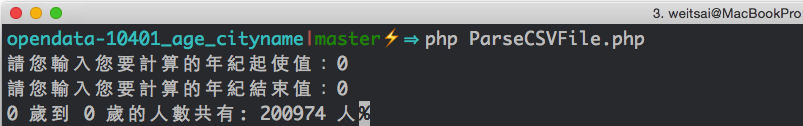

# taiwan-population-total
本專案主要是使用 [內政部開放資料平台](http://data.moi.gov.tw/MoiOD/default/Index.aspx)所提供的資料，來統計全台灣總人口數。

## 專案測試環境
作業系統： MAC 10.10
程式語言： PHP 5.5.14

## 資料來源
[各村（里）戶籍人口統計月報表](http://data.moi.gov.tw/MoiOD/Data/DataDetail.aspx?oid=F4478CE5-7A72-4B14-B91A-F4701758328F)

## 前製動作
1. 下載「村里戶數人口數單一年齡人口數-N」
  N 是你所需要的年份與月份的資料
2. 解壓縮後在資料夾中會看見非常多的 CSV 檔案
3. 把本專案的 `ParseCSVFile.php` 放到解壓縮出來後的資料夾中

## 資料格式
每個 CSV 檔代表一個縣市，縣市裡面又以村、里作為區分，格式如下：

| 統計年月 	| 區域別       	| 村里   	| 戶數 	| 人口數 	| 人口數-男 	| 人口數-女 	| n歲-男 	| n歲-女 	|
|----------	|--------------	|--------	|------	|--------	|-----------	|-----------	|--------	|--------	|
|   10401  	| 桃園市桃園區 	| 三元里 	| 1576 	| 4252   	| 2086      	| 2166      	| ...    	| ..     	|

## 使用方式
```
php ParseCSVFile.php
請您輸入您要計算的年紀起使值：0
// 不用 -1
請您輸入您要計算的年紀結束值：0
0 歲到 0 歲的人數共有: 200974 人
```

## DEMO

